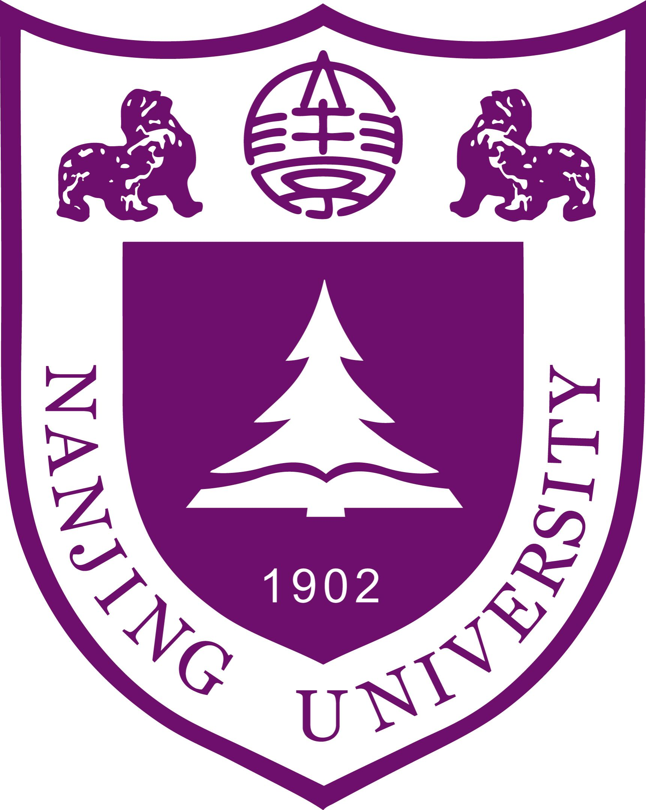
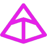
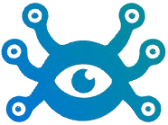

# Hi, I'm Elowen

  
  
  
  
   
  
  
  
  
  
  
  

I'm a **full-stack engineer** working with **Python**, **C++**, **Java**, and **TypeScript**. My interests center on **AI agents**, **LLM applications**, **LLM post-training**, and **knowledge graphs**, especially how they can be applied to real products. I work across frontend and backend development and also have some experience with **competitive programming**.

I want to keep growing as an engineer and build software that is useful, reliable, and thoughtfully designed. I enjoy creating polished web experiences, connecting them with the systems behind them, and turning ideas into products people can actually use. I'm also interested in independent development and exploring new ways to bring AI into everyday applications.

I earned my **MSSE from Nanjing University**  and am now based in **Shanghai**, working at **Ant Group** in the **Wealth and Insurance Business Group**. Before joining Ant, I worked at **Baidu**, **Meituan**, **Nestify Lab**, and **ByteDance**. **If our interests align, feel free to reach out to exchange ideas, explore collaboration, or discuss interesting projects.**

**Email:** [x19941941945@163.com](mailto:x19941941945@163.com)

  
  &nbsp;&nbsp;
  
  &nbsp;&nbsp;
  
  &nbsp;&nbsp;
  
  &nbsp;&nbsp;
  

**Publication**

**[TOSEM ’26] SGAgent: Suggestion-Guided LLM-Based Multi-Agent Framework for Repository-Level Software Repair.**

**Projects I've Contributed To**

  <a href="https://github.com/SWE-bench/experiments">&nbsp;<strong>SWE-bench</strong>&nbsp;</a>
   
  <a href="https://github.com/getpaseo/paseo">&nbsp;<strong>Paseo</strong>&nbsp;</a>
   
  <a href="https://github.com/pydantic/pydantic-ai">&nbsp;<strong>pydantic-ai</strong>&nbsp;</a>
   
  <a href="https://github.com/BerriAI/litellm"><picture><source media="(prefers-color-scheme: dark)" srcset="assets/contributions/litellm-dark.svg" /></picture>&nbsp;<strong>LiteLLM</strong>&nbsp;</a>
   
  <a href="https://github.com/vectorize-io/hindsight">&nbsp;<strong>Hindsight</strong>&nbsp;</a>
   
  <a href="https://github.com/earendil-works/pi">&nbsp;<strong>Pi</strong>&nbsp;</a>

<picture>
  <source media="(prefers-color-scheme: dark)" srcset="https://raw.githubusercontent.com/Mar-garet/Mar-garet/refs/heads/output/github-contribution-grid-snake-dark.svg" />
  <source media="(prefers-color-scheme: light)" srcset="https://raw.githubusercontent.com/Mar-garet/Mar-garet/refs/heads/output/github-contribution-grid-snake.svg" />
  
</picture>
